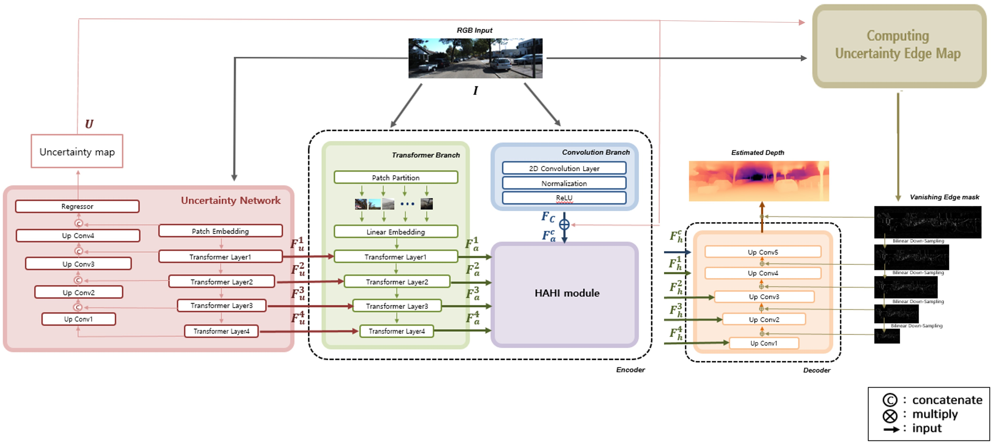

# Enhanced Monocular Depth Estimation Network Based on Uncertainty Edge Weighting Mask.

#### Ye-Ji Kim and Byung-Gyu Kim
#### Intelligent Vision Processing Lab. (IVPL), Sookmyung Women's University, Seoul, Republic of Korea

---

# Summary of paper

##### Abstract
> Depth estimation acts as an important factor for understanding spatial relations in the field of computer vision. In particular, it plays a key role in detecting obstacles and planning safe routes in autonomous driving technology. To ensure stability, improving the accuracy of depth estimation is emerging as an important issue, and research direction in the field of computer vision is also developing with the aim of improving accuracy.
Based on the analysis of an outdoor dataset in road driving, we investigate that depth network is difficult to predict accurate depth in distant regions.
Accordingly, this thesis aims to improve the overall performance by improving depth prediction accuracy in far-distance areas. For this purpose, we devise new modules in the encoder and decoder, respectively.
In the process of feature extraction, we propose an encoder modeling that can obtain information about distant regions where has a large loss compared to the near region.
In order to obtain information about distant areas, we employ an auxiliary network. By combining the features that are aware of this information by each layer, the reinforced features are extracted for the information about the uncertainty area.
In addition, we propose a methodology for generating a weighted edge map from a distance to allow the decoder generating depth to learn the edge information of the distant region.
To verify this, the performance evaluation on the distant region is taken for showing the improvement of 0.006, 0.073, 0.879, and 0.303 for Abs Rel, Sq Rel, RMSE, and RMSE log, respectively, on the KITTI dataset. For the DDAD dataset, improvement of 0.417, 0.242, 2.678, and 0.333 is observed respectively.
From these results, the proposed scheme can improve the overall performance by emphasizing the feature of the far-distant region.

##### Network Architecture

##### Experimental Results

---

# Training
'''
tools/dist_train.sh
'''

---

# Testing

---

